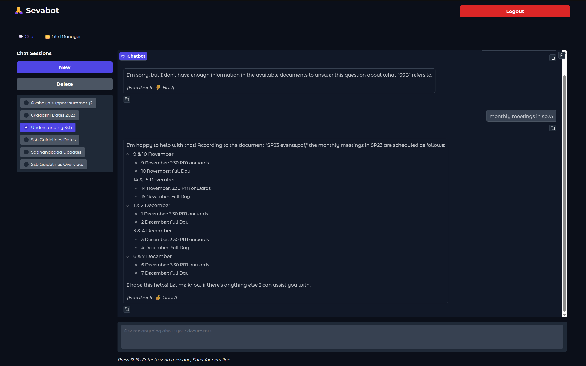

# Sevabot - Multi-User RAG Assistant

A clean, modular RAG (Retrieval-Augmented Generation) system with multi-user support, conversational memory, and file management.

## 📸 Screenshots

### Login Page


### File Manager


### Chat Interface


## ✨ Features

- **Multi-User Support**: Each user has their own document space and conversation history
- **File Management**: Upload, list, and delete documents with auto-indexing
- **Conversational Memory**: Maintains context across conversation turns
- **Session Management**: Up to 10 conversations per user with easy switching
- **ChromaDB Integration**: Efficient vector storage and similarity search
- **Clean UI**: ChatGPT-like interface built with Gradio
- **Feedback System**: Rate assistant responses (good/neutral/bad)
- **Secure Authentication**: Google OAuth with domain restrictions

## 🗃️ Architecture

### Modular Design
- `constants.py` - Application constants and configuration
- `config.py` - Environment configuration and validation
- `auth.py` - Authentication and session management
- `file_service.py` - File upload, storage, and management
- `rag_service.py` - Vector storage and document retrieval
- `chat_service.py` - Conversation management and RAG responses
- `ui_service.py` - UI service layer (business logic)
- `ui.py` - Gradio interface (pure UI)
- `main.py` - FastAPI application entry point

### Database Schema
- `users` - User profiles and authentication
- `conversations` - Chat sessions per user
- `messages` - Individual messages with feedback
- `user_documents` - File metadata and indexing status

## 🚀 Quick Start

1. **Clone and Setup**
   ```bash
   git clone <repository>
   cd sevabot
   pip install -r requirements.txt
   ```

2. **Environment Configuration**
   ```bash
   cp .env.example .env
   # Edit .env with your credentials
   ```

3. **Database Setup**
   - Create a Supabase project
   - Run the SQL schema from `database_schema.sql`
   - Add your Supabase credentials to `.env`

4. **Run Application**
   ```bash
   python main.py
   ```

5. **Access**
   - Open http://localhost:8000
   - Sign in with Google (domain-restricted)
   - Upload documents and start chatting!

## 📋 Requirements

### Environment Variables
```bash
# Required
SUPABASE_URL=your_supabase_url
SUPABASE_KEY=your_supabase_anon_key
SUPABASE_SERVICE_ROLE_KEY=your_service_role_key
OPENAI_API_KEY=your_openai_api_key
COOKIE_SECRET=your_secure_random_string
ALLOWED_DOMAIN=your_domain.com

# Optional (has defaults)
CHAT_MODEL=gpt-4o
EMBEDDING_MODEL=text-embedding-3-small
CHUNK_SIZE=1000
CHUNK_OVERLAP=200
TOP_K=8
```

### Supported File Formats
- `.txt` - Plain text files
- `.md` - Markdown files  
- `.pdf` - PDF documents
- `.docx` - Word documents

## 🎯 Usage

### File Management
1. Navigate to "File Manager" tab
2. Upload documents (auto-indexed into ChromaDB)
3. View file status and chunk counts
4. Delete files as needed

### Chat Interface
1. Create new conversations (max 10 per user)
2. Ask questions about uploaded documents
3. Switch between conversation sessions
4. Provide feedback on responses

### Admin Features
- Health check: `/health`
- API status: `/api/status`
- Admin docs: `/admin/docs`

## 🔧 Configuration

### User Limits
- **Max Sessions**: 10 conversations per user
- **Max File Size**: 10MB per file
- **History Context**: 10 recent conversation turns
- **Search Results**: 8 top relevant chunks

### RAG Behavior
- **Accuracy Focused**: Says "I don't know" when information isn't available
- **Source Attribution**: Mentions document names in responses
- **Conversational**: Maintains context across turns
- **Multi-Document**: Searches across all user's uploaded documents

## 🛠️ Development

### Adding New Features
1. **Backend Logic**: Add to appropriate service files
2. **UI Components**: Modify `ui.py` 
3. **Database Changes**: Update `database_schema.sql`
4. **Configuration**: Add to `constants.py` or `config.py`

### React Migration Ready
- UI logic isolated in `ui.py`
- All business logic in service layers
- Clean API boundaries
- RESTful patterns

## 🔒 Security

- **Domain Restriction**: Only allowed email domains can register
- **Row Level Security**: Users can only access their own data
- **Session Management**: Secure cookie-based authentication
- **File Isolation**: User documents stored in separate directories

## 📊 Monitoring

### Health Endpoints
- `/health` - Service status
- `/api/status` - Feature and limits info

### Logging
- Clean logs without deprecation warnings
- User actions and errors tracked
- File operations logged

## 🎨 UI Features

- **ChatGPT-like Design**: Clean, professional interface
- **Responsive Layout**: Works on desktop and mobile
- **Real-time Updates**: File uploads and indexing status
- **Session Management**: Easy conversation switching
- **Status Feedback**: Clear success/error messages

## 🚦 Limits and Warnings

- **Session Limit Warning**: Prompts to delete old conversations
- **File Size Validation**: Prevents large file uploads
- **Format Validation**: Only supported file types allowed
- **Domain Restriction**: Clear error for unauthorized domains

## 🔄 Migration Notes

When migrating to React:
1. Keep all `*_service.py` files unchanged
2. Replace `ui.py` with React components
3. Add REST API endpoints in `main.py`
4. Use existing service layer methods

## 📄 License

[Your License Here]

## 🤝 Contributing

1. Fork the repository
2. Create feature branch
3. Make changes in appropriate service files
4. Test thoroughly
5. Submit pull request

---

**Note**: This is a naive RAG implementation focused on accuracy and simplicity. For production use, consider adding rate limiting, advanced error handling, and monitoring.